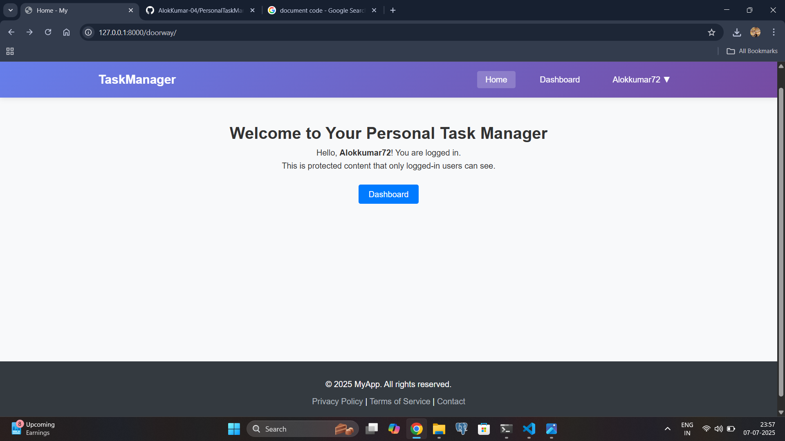
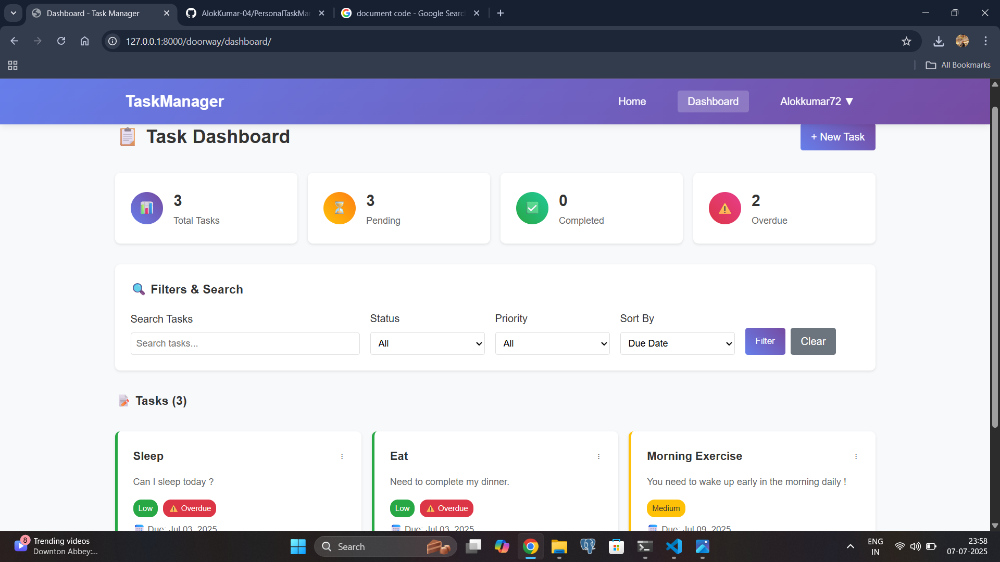
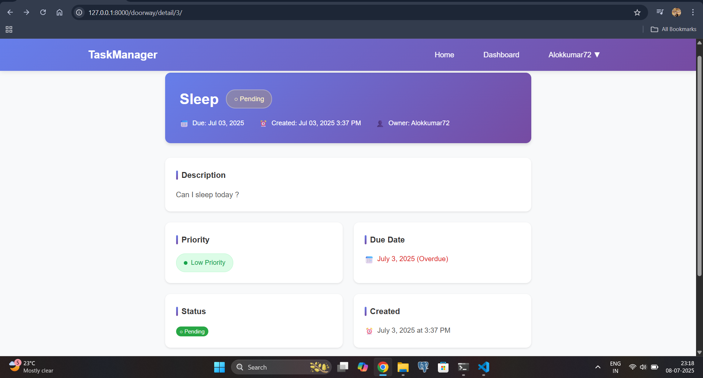

# 🗂️ Django Task Manager

A personal task management system built with Django. Users can sign up, log in, and manage their daily tasks through an intuitive dashboard. Features include task creation, updating, filtering by priority or status, task statistics, and completion tracking.

---

## 📸 Preview

> Add screenshots in the `screenshots/` folder and update paths below.

| Home Page | Dashboard | Task Detail |
|-----------|-----------|-------------|
|  |  |  |

---

## ✨ Features

- 🔐 **User Authentication**
  - Sign Up, Login, Logout
- 📝 **Task Management**
  - Create, Update, Delete Tasks
  - Toggle task completion
- 🔍 **Search and Filters**
  - Search by title or description
  - Filter by status: Completed, Pending, Overdue
  - Filter by priority: High, Medium, Low
- 📊 **Task Statistics**
  - Total, Completed, Pending, Overdue
- 📆 **Sorting Options**
  - Sort by Due Date, Priority, Title, Created Date
- 📄 **Detail View**
  - Task details page with overdue indicator

---

## 🛠️ Tech Stack

- **Backend:** Django 5.x
- **Frontend:** HTML, CSS
- **Database:** SQLite (default)
- **Authentication:** Django’s built-in system

---

## 🚀 Getting Started

### 1. Clone the repository

```bash
git clone https://github.com/yourusername/django-task-manager.git
cd django-task-manager
```

### 2. Create and activate a virtual environment

```bash
python -m venv venv
# Activate on Windows
venv\Scripts\activate
# Activate on macOS/Linux
source venv/bin/activate
```

### 3. Install dependencies

```bash
pip install -r requirements.txt
```

### 4. Apply migrations

```bash
python manage.py migrate
```

### 5. Create a superuser (optional for admin access)

```bash
python manage.py createsuperuser
```

### 6. Run the development server

```bash
python manage.py runserver
```

### 7. Access the app

Visit [http://127.0.0.1:8000](http://127.0.0.1:8000) in your browser.

---

## 📁 Project Structure

```
doorway/
├── templates/
│   ├── doorway/
│   │   ├── home.html
│   │   ├── dashboard.html
│   │   ├── create_task.html
│   │   ├── update_task.html
│   │   ├── delete_task.html
│   │   └── task_detail.html
│   └── registration/
│       ├── login.html
│       └── registration.html
├── models.py
├── forms.py
├── views.py
├── urls.py
```

---

## ✅ Example User

| Username | Password     |
|----------|--------------|
| demo_user | test@1234  |

You can also register as a new user.

---

## 📬 Feedback & Contributions

Contributions are welcome! Feel free to open an issue or submit a pull request. ⭐

---

## 📄 License

This project is licensed under the [MIT License](LICENSE).
